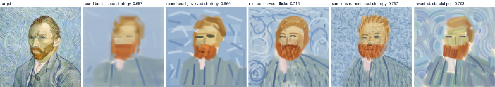

# conveyor

Co-evolve two things that depend on each other, and watch every step. The problem here is painting. One node evolves the **instrument**: a small program that defines the tools a painter gets, what each call takes, and what it draws. The other node evolves the **painter's strategy prompt**. A model copies van Gogh's *Self-Portrait* of 1889 using only the instrument's tools, other models mutate both nodes, and a judge scores the result. Each of those roles runs on Claude Code or on Pi, with whatever model you pick. Everything goes into one SQLite file, and a local dashboard reads it while the run goes.

## Quick start

```sh
uv sync
uv run conveyor run --offline --cycles 3          # no model: a greedy painter and a scripted mutator, about 5 s
uv run conveyor paint round --actions 40          # one real painting with the round-brush seed, about 1 minute
uv run conveyor mutate round --operator invent -n 3 --lanes 3   # three inventions from the round brush, no painting
uv run conveyor run --cycles 4 --budget 20        # the real co-evolution, dashboard at http://127.0.0.1:8765
uv run conveyor serve                             # browse earlier runs, or start new ones from the New run button
uv run conveyor run --harness pi --cycles 4        # the same run on GLM through Pi (see Harnesses)
uv run --group dev pytest                         # 70 tests, about 25 s, no model calls
```

### Starting runs from the dashboard

`conveyor serve` opens the dashboard on `runs/conveyor.db` (`--db` picks another file, and it's created if it's missing). The **New run** button opens a form with every `conveyor run` option: models per role, the target and canvas, the evolution weights, spend and rate-limit caps, and `--wait`. Defaults and tooltips come from the command line's own parser, and the form shows the equivalent command. Offline mode is a checkbox, so a first look needs no model.

Each run is a child process, `conveyor run --no-serve`, writing to the served database, so several can go at once and the dashboard follows them like any other run. **Stop run** in the header sends the process Ctrl+C. Stopping the server stops the runs it started. Pi needs an API key in the environment `conveyor serve` was started from, or an OpenAI Codex subscription login saved by `conveyor auth login openai`.

Starting runs spends your money and your Claude usage, so it is only on when the server is bound to a loopback address (the default), and POSTs from other origins or hosts are refused. `--no-launch` turns it off.

To serve it on a network (a container behind a proxy), set `CONVEYOR_LAUNCH_TOKEN` (16 characters or more) or pass `--launch-token`. The dashboard's reads stay open, but starting or stopping a run, and the form's options, ask for the token. The New run button prompts for it once and keeps it in that browser. With no `claude` on the host, the form defaults to the Pi harness. `Dockerfile` and `compose.yml` run exactly this: a container that only serves, with every run started from the UI.

The Pi harness needs Node 22.19 or later and a one-time `(cd pi-agent && npm install)`.

For the deployed service, sign in to your ChatGPT subscription once from the container:

```sh
docker exec -it conveyor-conveyor-1 conveyor auth login openai
```

Open the device-login URL it prints, enter the code, and approve access. The credential is stored at `/data/pi-auth.json` on the persistent Docker volume, so it survives `deploy-conveyor` redeploys. Check or remove it with `conveyor auth status` or `conveyor auth logout openai` inside the container. Select `openai-codex` as the Pi provider in the New run form.

You need Claude Code installed and logged in, so `claude --version` has to work. conveyor uses whatever auth your `claude` uses. On a subscription the dollar figures are list price, not a bill, but they're the best single measure of how much of your plan's rate limit a run eats. Every session reports the five-hour and weekly usage windows. The dashboard shows them, and `--max-usage` (default 0.85) stops a run from starting new sessions once either window is that full, so a run never takes the last of a window you share with your own Claude use. On the plan these numbers come from, a five-hour window held roughly $13 to $15 of list-price Opus usage.

With `--wait`, a full window pauses the run instead of stopping it. New sessions wait until the window resets, plus a minute of grace, and the dashboard shows the run as waiting, with the time it resumes. A session the limit ends partway (two lanes can start at 84% and finish past 100%) doesn't count. Whatever it was painting or mutating runs again after the reset. `--wait` only waits for resets up to 6 hours away, which covers the five-hour window; the weekly window still stops the run. `--wait 200` waits for that one too. Raise `--budget` to match, since a run that waits can go on for many windows.

Numbers from runs on this laptop (at the 128 px canvas these runs used; the default is 512 now, which makes each
call and each picture bigger, so expect somewhat higher figures):

| What | Time | List price |
|---|---|---|
| One painting, 40 actions, pen instrument | 65 s | $0.25 |
| One painting, 60 actions | 100 to 134 s | $0.41 to $0.48 |
| One strategy mutation | 21 s | $0.05 |
| One `invent` mutation with the task budget | 87 to 149 s | $0.35 to $0.58 |
| One `invent` mutation before the task budget | 11 min | $0.86 |
| One full cycle: seed painting, strategy mutation and its painting, one invention and its painting | about 9 min | $1.97 |
| Three cycles at 120 actions, two instrument mutations per cycle, stopped by `--budget 10` | about 70 min | $10.27 |

By that rate a 200-action painting is around 7 minutes and $1.50. `--lanes` sets how many Claude sessions run at once. The default is 2, because they share one rate limit.

**Sessions that die.** A provider can take a request and then say nothing until the connection drops. `--stall-timeout` (default 600 seconds, 0 turns it off) kills a session that prints nothing for that long, instead of holding a lane for the full 45 minutes. A session cut off this way, or by a crash or a timeout, is not scored as a bad painting. Its job runs again, twice at most. If it still fails, the evaluation is recorded as inconclusive: the organism keeps its viability and its standing, and a champion that fails a rescore stays champion. The Pi sidecar logs each request (`request_start` with the images and bytes it sent, `request_end` with the time to first event), so a stalled session shows what it was waiting on.

**Painter token usage.** `paint_batch` is on by default for both harnesses. It puts up to 40 ordered instrument calls in one tool call, shares repeated arguments, and returns one final score and state instead of per-stroke feedback. Each underlying call still uses one action and gets its own area limit. The first failure stops the batch, keeps earlier successful calls, and skips the rest. Stroke logs and replay snapshots still record each underlying call. `--no-paint-batch` removes this tool and its prompt instructions.

Pi paintings also use bounded working history by default. `--paint-context-turns 2` keeps the latest two complete assistant turns, the complete turn containing the newest canvas view, the initial task with its target and demo sheet, and current server state. Other retained canvas images are omitted. The painter saves a working plan of at most 1200 characters in each batch; the server supplies pen state, active scope, remaining actions and looks, and score. No model summary call is needed. Only the model-facing history is shortened; the full transcript stays in the database. Mutators and judges are unchanged. `request_start` reports model-facing text characters as well as image counts, and `painter_context` reports each trim's before/after text sizes. These are size diagnostics, not tokenizer measurements.

For a full-history comparison, use `--no-paint-batch --paint-context-turns 0`. Bounded history is Pi-only; Claude Code keeps its own context handling. An explicit `--compact-every-looks N` selects the older Pi model-summarization mode instead of bounded painter history. `--autocompact TOKENS` sets Claude Code's compaction window, 100000 to 1000000. Neither model-summarization setting is on by default.

## Harnesses

Every model interaction is a job run by a harness, and there are two:

- **`claude`** runs Claude Code headless, `claude -p`, with your Claude login. The default model is Claude Opus 5.5.
- **`pi`** runs Pi's agent loop in a Node sidecar (`pi-agent/agent.mjs`) on OpenCode Go, OpenRouter, or OpenAI Codex. OpenCode Go and OpenRouter use `OPENCODE_API_KEY` or `OPENROUTER_API_KEY`; OpenAI Codex uses a ChatGPT subscription login saved with `conveyor auth login openai`. The default is `glm-5.3-flash` on OpenCode Go. Choose `openai-codex` with `--provider` or the New run form.

`--harness`, `--model` and `--effort` set every role. `--paint-*`, `--mutate-*` and `--judge-*` override one:

```sh
uv run conveyor run --harness pi --model qwen3.8-max                       # everything on Qwen through Pi
uv run conveyor run --harness pi --judge-harness claude                    # paint and mutate on GLM, judge on Opus
uv run conveyor run --paint-harness pi --mutate-effort medium              # paint on GLM, the rest on Claude Code
```

A role on a different harness from `--harness` doesn't inherit `--model`, because a Claude model id means nothing to Pi and the other way round. Roles that ask for the same harness, model and effort share one runner.

The Pi sidecar is a drop-in for `claude -p`. It launches the same MCP servers (the paint server, the workbench), hands their tools to the model, and prints Claude Code's stream-json events, so the recording, the dashboard and the stroke logs don't know which harness ran a session except by its label. Where Claude Code has `--json-schema`, the sidecar gives the model a `respond` tool and returns what it's called with. A job names the tools that end it (`finish`, `submit_instrument`), since Pi's loop otherwise runs until the model stops calling tools. On OpenCode Go, which takes at most 8 images per request, the sidecar drops the oldest canvas views and never the target.

Spend is tracked across both harnesses against one `--budget`. Rate limits are tracked per harness: an exhausted Claude window stops Claude sessions and leaves Pi ones running. A 30-action painting on `glm-5.3-flash` cost $0.003, and its judge verdict $0.0001.

## How a painting runs

On the Claude Code harness each painting is one `claude -p` process:

```
claude -p --input-format stream-json --output-format stream-json --verbose
       --model claude-opus-5-5 --effort high --thinking-display summarized
       --system-prompt <strategy + rules + the instrument's reference>
       --tools "" --setting-sources "" --strict-mcp-config
       --mcp-config <python -m conveyor.painting.paintserver SESSION_DIR>
       --allowedTools mcp__canvas__<each tool and viewing tool>,mcp__canvas__look,mcp__canvas__finish
       --no-session-persistence --disable-slash-commands --max-budget-usd 8
```

- `--tools ""` removes the built-in tools. A painter with Read or Bash could open the target file.
- `--setting-sources ""` keeps this machine's hooks, CLAUDE.md files and settings out of the painting.
- `--strict-mcp-config` loads only conveyor's server. Without it the account's claude.ai connectors load too, and a probe call cost ten times as much in tool definitions alone.
- `--thinking-display summarized` is a hidden flag. In print mode thinking comes back empty without it. If a CLI version refuses the flag, conveyor retries without it and the transcripts lose the reasoning.

The first user message goes in over stdin, because stream-json is how it carries images: the target with a labelled coordinate grid, and the instrument's demo sheet. Then stdin closes and the CLI runs the agent loop until the painter calls `finish`.

Claude Code launches the paint server, `painting/paintserver.py`, as a child process and talks MCP to it over stdio. The paint server owns the canvas and the instrument's `pen` state. It applies each call and answers with the tool's effect and the actions left. Quality scores, pixel error and regional error tables are not shown to the painter, including in batch results, views and structured working state. The painter compares images and completes the major regions and defining shapes before deciding to finish. It logs every call to `calls.jsonl` with its arguments, its effect, changes in critic score and pixel error, the pen's state after it, and a canvas snapshot every five calls. Diagnostics and final scoring still use these metrics; the critic and judge weights are unchanged. Claude Code runs the tool calls of one reply one at a time, in order, which a probe confirmed, so strokes land in the order the model wrote them.

The painter normally groups marks through `paint_batch`. For a single tool it can send:

```json
{
  "tool": "stroke",
  "defaults": {"angle": 0, "length": 30, "size": 6, "color": "#6f8fb5"},
  "calls": [{"x": 10, "y": 20}, {"x": 30, "y": 25, "color": "#223344"}],
  "plan": "Background blocked in. Face and jacket next."
}
```

For mixed tools, `calls` contains `[tool_name, arguments]` pairs. Shared defaults apply only to parameters that each tool accepts, and call arguments override them. Views, scope, finish and nested batches cannot go inside a batch. The original instrument tools remain available for individual calls.

The painter ends with a note for the instrument's designer saying what the target needed that the tools couldn't do. That note goes to the next mutation. Here is part of the first real one, from the pen seed:

> The area limit wasn't described in the tool docs. I only learned about it from the "stopped early" messages. ... What would have helped: a fill or wash tool for the ground colour, or a much larger brush radius.

The first complaint was a gap in my rules, not in the instrument, and the rules now state the limit.

## Instruments

An instrument is one Python module. It declares its tools, their parameters, any state they share, and example calls. The painter gets exactly these tools as MCP tools:

```python
"""What the painter should know. It reads this cold."""

STATE = {"down": False, "x": 0.0, "y": 0.0}

TOOLS = {
    "start": {"doc": "Put the pen down at (x, y).",
              "params": {"x": {"type": "number", "min": 0, "max": "width"},
                         "y": {"type": "number", "min": 0, "max": "height"},
                         "color": {"type": "color"}}},
    "move": {"doc": "Drag the pen by (dx, dy).", "params": {"dx": {"type": "number"}, "dy": {"type": "number"}}},
    "stop": {"doc": "Lift the pen.", "params": {}},
}

EXAMPLES = [[["start", {"x": 12, "y": 30, "color": "#2b4c7e"}], ["move", {"dx": 20, "dy": -6}], ["stop", {}]]]

VIEWS = {"detail": {"doc": "Look closely at (x, y): a window `span` px across.",
                   "params": {"x": {"type": "number", "min": 0, "max": "width"},
                              "y": {"type": "number", "min": 0, "max": "height"},
                              "span": {"type": "number", "min": 8, "max": "width", "default": 64}}}}

def start(args, pen, canvas, rng):
    pen.update(down=True, x=args["x"], y=args["y"], color=args["color"])

def detail(args, pen, canvas, rng):
    return canvas.view(args["x"], args["y"], args["span"])
```

Parameter types are number, integer, boolean, color, choice, points and numbers. A points parameter is a path of up to 64 `[x, y]` pairs, and parameter bounds may be written against `width`, `height` and `radius` (the canvas's brush limit; `"-width"` and friends for deltas), so one instrument reads right at any canvas size. Tools draw only through `canvas.dab`, `canvas.stamp` for any small mask, `canvas.smudge`, and `canvas.pick`, which reads the canvas and never the target. `painting/seeds.py` has two complete examples. `round` is one stateless straight stroke. `pen` is the start/move/stop plotter above, with a brush that runs out of paint as it travels.

Seeing is part of the interface, so the instrument owns it too. `VIEWS` declares up to four viewing tools, and `canvas.view(x, y, span, scale)` cuts a window out of the canvas and hands it back gridded and labelled in canvas pixels. Viewing is free — no action, no look — and cannot change the painting: the canvas and the pen are put back after every view call. The painter also keeps the harness's `look`, which shows the whole canvas from a small budget of looks, so a painter is never blind. That split is what makes a big canvas workable: the default is 512 px wide (four times the linear size of the 128 this started at), and at that size the whole-canvas picture is too coarse for fine work. The painter zooms through the instrument's views; evolution decides what views exist, and a mutation that gives its painter better eyes is competing on vision as well as on marks.

With `--scope`, the painter can also paint in a window: the harness's `scope` tool sets a square scope and shows it labelled from its own corner, and later paint calls take local coordinates there until cleared. Only 0-based canvas positions shift into the window (deltas, sizes and angles are unchanged, by the same bound convention as above), and scoping is free like a view. Off by default, so runs with and without it compare cleanly — the experiment is whether painters do finer work when they stop converting zoomed pixels to canvas coordinates by hand.

The physics puts one limit on a call: it may touch at most 8% of the canvas, which is about 21,000 px at 512 x 512. That keeps a tool a brush rather than a printer. It says nothing about what a call takes or whether calls share state, so the interface stays free to evolve. Each call also runs under a one-second limit, in the paint server's process, never in the process that runs the evolution. The sandbox refuses imports, classes, try/except, print, underscored names and any attribute off an allowlist. It stops accidents. It is not a security boundary.

## Why the old toolkit didn't vary, and what changed

The question was how to get the mutator to vary the toolkit's inputs, for example with tools that start at a point and move in some direction until a stop tool runs. The old design could never produce that, and prompt changes alone wouldn't have fixed it. The cause was in the harness.

1. **The interface wasn't in the genome.** `brush_tools()` and the Pi sidecar gave every brush the same `x, y, angle, color, pressure`. The mutator's output schema held a name, a radius, a length and an alpha-mask program. No mutation could change what a call takes.
2. **A brush was a pure function of one straight segment.** `alpha(u, v, rng, radius, length)` had no state, no path, and no way to read the canvas.
3. **The verification gate rejected anything the oracle couldn't drive.** The oracle fitter placed brushes at random `(x, y, angle)` inside 16 px patches, and `verify_mutations=True` kept a toolkit only if the oracle's error on the failing patches dropped. A tool with a different interface can't pass that test.
4. **The prompt asked for small changes.** It said "Keep brushes that work. Change as little as fixes the failures."
5. **The feedback was per-patch RMSE,** which points at thinner liners and softer washes.

The recorded runs show the result. Every LLM toolkit mutation in `big2.db`, 20 of them, was a variation on one capsule brush: add granulation, add a thinner "whisker" liner, soften the wash. Brushes-as-code never got a full LLM run before this rewrite. The one database with code-based brushes holds only the seed, from a run whose sidecar died after seven calls.

The rewrite answers each cause:

- **The instrument declares its own tools and parameters, and `pen` persists across calls.** Start/move/stop is now one mutation away.
- **The oracle and its gate are gone.** The painter's closing note replaces them as the signal for what the tools lack.
- **A niche archive keeps different interfaces alive.** The workbench measures three things about each instrument: does any tool keep state, does any tool take a list, and how far one call reaches. That gives 12 niches. The instrument node keeps the best instrument in each and draws parents across niches rather than by score, so a new interface that paints worse than the champion still gets children.
- **Three mutation operators with different jobs.** `refine` improves an instrument and keeps its interface. `invent` designs a different way of calling it, aimed at a named empty niche, and it prefers niches that change state or argument structure over ones that only change reach. `recombine` merges two instruments from different niches.
- **The designer works in a workbench.** It can compile a draft, run its examples, and see the demo sheet and the niche before it submits. A broken draft costs a try, not a whole painting, so a bold design is cheap to attempt.

The first `invent` from the round brush produced "shape stamps". `block` presses a rotated rectangle, ellipse, triangle or soft blob, `ramp` presses a two-colour gradient tile, and `blend` smears wet paint. Its docstring tells the painter to lay a mosaic of 24 px tiles, then smaller shapes, then detail. Nothing in the old setup could have made that. It also spent several tries chasing a one-pixel seam between tiles, so designer sessions now carry an 80k-token task budget through Claude Code's hidden `--task-budget` flag, and the prompt says pixel polish doesn't matter at this size.

With the budget in place I ran `conveyor mutate round --operator invent -n 3`, which asks for a different interface kind each time. Every invention started from the same round brush:

| Asked for | Landed in | What it is | Tries | Time | List price |
|---|---|---|---|---|---|
| stateless/scalar/short | same | `block`, `ramp`, `blend`: shape stamps, gradient tiles, a smear | 5 | 11 min | $0.86 |
| stateful/scalar/short | same | `load` with palette mixing, `lift_to`, `draw(dx, dy)`, `smear`: a loaded pen that remembers where it is | 2 | 87 s | $0.35 |
| stateful/list/short | same | `load`, then `touch(x, y, offsets, connect)`: press clusters of marks or drag a short polyline with the loaded brush | 2 | 95 s | $0.37 |
| stateless/list/short | same | `patch`, `line`, `dots`, each taking a list of offsets: polygons, polylines, stipple | 2 | 115 s | $0.44 |

The first row ran before the task budget. All four hit the niche they were asked for.

A one-cycle co-evolution run then put an invention in front of the painter. The designer built a loaded-brush instrument with `load` plus three list tools, `stroke` through points, `patch` for a filled polygon, and `blend` along a path. Its first painting scored 0.645 against 0.652 for the round brush with the same strategy. The painter had never seen it before. That painting also found a bug in my sandbox: numpy 2 imports a module lazily on the first `ndarray.max()` in a process, through the calling frame's builtins, and the sandbox had no `__import__`. Every `patch` call failed. The probe missed it because its own `.max()` calls ran first and warmed numpy's cache. The sandbox now lets numpy import its own modules and nothing else, and a test covers the first-call case in a fresh process. The loaded pen is the start/move/stop idea almost exactly, with a palette `mix` the designer added on its own so the painter can shade without guessing hex values.

All four also landed at short reach. The per-call area limit is in the designer's prompt, and small local marks are the natural answer to it, so the long-reach niches may stay empty unless an invention is aimed there. Whether any of these interfaces paints better than the round brush is a separate question, one only co-evolution runs answer.

## The first real run

Three cycles at 120 actions per painting, two instrument mutations per cycle, stopped by `--budget 10` partway through the third cycle. It took 15 sessions, $10.27 at list price, and about 70 minutes, and moved the five-hour usage window from 12% to about 80%.



Scores went from 0.657 to 0.757:

- **Cycle 1.** A new strategy took the round brush from 0.657 to 0.666. Both instrument mutations drew `refine`. The painter's note had asked for curves, tapered lines and swirl texture, and both refinements added them: the winner kept `stroke` and added `path`, a curve through points, and `flicks`, up to 64 short curved dashes in one call. It scored **0.716** with the same strategy, the biggest single step of the run. The two refinements converged on nearly the same design, which is what `refine` does when two copies read the same note.
- **Cycle 2.** The strategist saw that the last painter had left 28 of its 120 actions unused and told it to spend every one and to pack texture along the flow of the target. Same instrument, **0.757**. Both instrument mutations drew `invent`: a stateful loaded brush with list tools at 0.695 and a stateful brush with an accent colour and hue jitter at 0.703. Neither beat the champion, and both stay in the archive as parents.
- **Cycle 3.** The strategy child scored 0.715 from a weaker parent. The budget stopped the run before the instrument step.

The archive ended with 4 of 12 niches filled by 5 instruments. The run found two problems I then fixed:

1. **The painter steered by a different number than the one that judged it.** Each call reported only pixel RMSE, but the critic weighs texture and palette at 40%. The cycle-1 painter watched its swirl texture push pixel error up, concluded it was hurting, and stopped early, on the painting that scored best of the run. Initially, each call was changed to report the critic's score first and pixel error second. That still encouraged the painter to optimise a pixel-heavy proxy while working. The current interface keeps both numbers in diagnostics only; looks and views show the painting without error tables.
2. **Strategy prompts were cut off mid-section.** A plain slice at 2,500 characters truncated one; the strategist noticed it in the next generation. The limit is now 3,000 characters asked for and 4,500 enforced, cutting at a paragraph break with a note in the summary.

## Judging

The deterministic critic, `painting/critic.py`, scores 60% pixel RMSE at three scales and 40% texture statistics: edge density, stroke direction, fine detail, palette. After the first run I rated its 8 paintings and 6 control images by hand and compared four judges against those ratings, by rank correlation:

| Judge | Copies the target | Looks like van Gogh |
|---|---|---|
| Critic total | +0.89 | +0.34 |
| Critic, texture part | +0.73 | +0.65 |
| Laya Vision, a 256M decision model | +0.46 | +0.32 |
| CLIP ViT-B/32, zero-shot and untrained | +0.61 | +0.75 |

Laya ranked five of the run's paintings above *The Starry Night* on "looks like van Gogh", and its two-image "is this a copy" answer carried no signal. Its training covers everyday questions and photo quality, not painting, so fine-tuning it on a dozen ratings wouldn't fix that. CLIP's base model did better with no training. The larger CLIP rated nearly every copy of this portrait as van Gogh, probably because it recognises the famous subject rather than the brushwork.

So each finished painting now also goes to a Claude judge (`painting/judge.py`). The judge sees only the target and the painting. It scores likeness, colour, brushwork and overall from 1 to 10 against anchors written into its prompt, and writes a critique that goes to both mutators. A painting's score is `(1 - w) * critic + w * judge`, with `w` from `--judge-weight` (default 0.5). The painter still gets the instant critic score after each call, so it can't probe the judge one stroke at a time. `--judge-model` and `--judge-effort` pick the judge's model and effort, and `--no-judge` turns it off. A judge call costs a few cents against a painting's dollar.

Validating the Claude judge against the same hand ratings hasn't run yet: the usage window ran out first. Until it has, treat the judge's weight as a guess. Logit-based scoring, reading a model's probabilities over "1" to "9" and taking the expected value, would give smoother verdicts, but Claude doesn't expose logits. It would need a local open-weights vision model.

## The evolution loop

`evolve.py` is a small loop written for this problem, replacing the darwinian_evolver library the old version wrapped. The variance work needed parent selection across niches and a mutation context that carries the archive, the empty niches and the lineage. Bending the library to that would have taken more code than the loop.

Each cycle the painter node runs one mutation and the instrument node runs `--parents` mutations, each followed by a painting. A painting pairs one instrument with one prompt, and that one painting scores both organisms. Paintings are cached by the pair and numbered, so both nodes read the same ones.

**Scores are means, and a champion has to hold up.** One painting is a noisy measure. Repainting one pair six times with gpt-6-luna gave a spread of 0.459 to 0.553, about as wide as a whole run's population. Picking the best of forty single paintings mostly picks a lucky one, and then no child can beat it. So an organism's score is the mean of its paintings against the current partner, and when a child tops the ranking, it and the champion it would replace are painted again until each stands on `--confirm` paintings (3 by default). The means decide. A child that loses on its first painting costs nothing extra. When a new champion is crowned, the partner node's champion is re-scored against it using the same three paintings, so the cascade is free.

**The strategist edits; it doesn't rewrite.** It returns edits, each quoting the passage it replaces, and they're applied to the parent prompt. A child that keeps less than half the parent's words is refused. Before this, a strategy child kept 13 to 24% of its parent's words, so every generation was a new prompt and nothing it learned carried over.

The mutators see the parent's source or prompt, the target beside the painting, the score breakdown, how the painter spent its actions, how many calls were refused or ran out of area, the painter's note, and a learning log of the lineage's earlier changes and what each did to the score.

## The dashboard

`conveyor run` serves it while the run goes. `conveyor serve` serves any database afterwards.

- Node cards with each champion: the instrument's demo sheet and painting, and the strategy's painting.
- The instrument archive as a grid, stateless and stateful rows by scalar and list columns at three reaches, with empty cells shown. Variance, or its absence, shows here at a glance.
- Claude sessions running now, with their latest thinking and tool calls.
- Scores over time with champion steps, a mutator table, and every organism. The mutator table counts tries, errors, viable children, children that beat their parent, children in a new niche, hits on the asked niche, and cost.
- A drawer for any organism: source with a diff against its parent, demo sheet, every painting with the painter's note, and the session that wrote it.
- A drawer for any Claude session: system prompt, first message with its images, the full transcript with thinking summaries, each tool call with its result, its error change and the pen's state after it, and a replay slider over the canvas snapshots.

### Painter studio

Open **Painter studio** in the dashboard header, or `/studio?run=<run-id>`. This separate page graphs every saved painter prompt, every instrument and its tool names, and every painting session. Repeat evaluations of the same painting appear once. Unused and failed instruments remain visible. Lines connect paintings to their prompt and instrument, and dotted lines connect organism parents. Drag the background to pan, use the zoom buttons or **Fit all**, and search to highlight nodes without hiding the rest.

Click a painting to reuse its exact instrument and strategy prompt. Clicking a prompt or instrument selects that version and its most recent painting partner, which you can change using the two dropdowns. Enter a text brief, upload a reference image, or provide both, then choose **Request painting**. Uploads accept PNG, JPEG and WebP, up to 6 MB and 16 million pixels. Images become new targets at the original run's canvas width. Text-only paintings keep the original canvas dimensions.

Requests inherit the run's harness, provider, resolved model, thinking effort, context controls, action/look budgets, batching, scope and per-painting spend cap. New runs save resolved role settings, including Pi's model definition, so later catalog/default changes do not change them. Older runs recover the model and effort from recorded sessions when available and use their saved run configuration for the rest. No model overrides are accepted by the request API.

Image requests use the usual critic and the run's judge settings. Text-only requests reuse the strategy and painting tools, adapting copying instructions to the brief. They have no RMSE, critic score, heatmap or likeness judge. The offline greedy painter only supports image requests.

Requests, sessions, strokes and resulting paintings are stored under the original run, but requests never become evolutionary evaluations or affect champion rankings. They can be made after a run finishes. The graph refreshes while painting, and **Open session and tool calls** opens the existing transcript/replay drawer. **Stop** interrupts a request, and shutting down the server stops its child processes. Results remain in the database after restart.

Starting paintings requires `conveyor serve` with launching enabled. A dashboard served by `conveyor run`, or by `conveyor serve --no-launch`, can browse the graph but cannot submit requests. Requests use the same launch token, same-origin and JSON guards as starting runs. Each request has its own inherited per-painting cap, rather than continuing the original evolution's total-budget countdown.

### Shared canvas

Open **Shared canvas** in the dashboard header, or `/canvas`. It's one unbounded canvas that many agents paint on at once, with no target, no score and no end. A canvas can have a task: one image, described in text when the canvas is created, that every agent on it is told to make together. The agent gets the task word for word, told only that the image spans the whole canvas, far beyond its viewport, with other agents painting the rest. Nothing says how to share the work; the page shows it above the canvas. It can't be changed later, so a new goal means a new canvas. Without a task the agents are told there is no goal. Either way the prompt tells agents that nothing on the canvas belongs to anyone, to judge what they see, and to paint over and redo what is weak, theirs or anyone's. Early prompts only listed painting over as one option among working beside, extending and answering, and on three canvases 75 to 87% of tile writes landed on blank paper or the agent's own paint. Each agent sees it through a square viewport (512 px by default) and paints as one painter from the catalog. A painter is an instrument together with the prompt it painted with. They evolved together and were scored together, so the catalog never splits them. It offers only pairs that painted together, and from each run only the 5 pairs with the best painting scores in that run; everything else is left out. A pair repainted to confirm its score takes one place, and an unscored text-only studio painting can't place. Each pair appears once, however many runs it placed in, with its best score, its place in each run, its number of paintings and its best painting. On a database with no scored paintings yet, the catalog falls back to the seed instruments with the starting strategy, so there is always something to spawn. By default the spawn form draws a painter at random, every pair in the catalog the canvas can run equally likely (the API takes `pair_id: "random"`); untick **Random painter** to pick one. A successor draws a new painter at random, the way a random spawn does, and starts exactly like an agent spawned by hand at that spot, with nothing saying it's a successor. Agents can run on different harnesses, providers, models and efforts, side by side.

An agent's tools:

- **The instrument's own tools**, in viewport coordinates. The viewport is the instrument's whole canvas, so any instrument from any run works unchanged, and marks stop at the viewport's edge. The per-call area limit still holds.
- **`look`** shows the viewport as it is now, including whatever other agents painted since the last look.
- **`overview`** shows the canvas around the agent: a square four viewports across (2,048 px at the default size), centred on its viewport and shrunk to 512 px, with a grid labelled in canvas coordinates and the viewport outlined in magenta. With moves of at most three quarters of a viewport, that reaches two moves out in every direction. The scale is fixed, so neighbouring work stays legible however large the canvas grows; the result also says, as text, how far the paint on the whole canvas reaches. Other agents' viewports aren't marked. The first version shrank the whole canvas into one picture, and on a canvas 7,900 px wide a viewport came out 33 px across, too small to coordinate around.
- **`move_viewport`** takes an angle in degrees (0 right, 90 down) and a distance of at most three quarters of the viewport, so the new view always overlaps the old one. It returns the new view.
- **`write_message`** sets ASCII text in the viewport, in a 6 x 11 bitmap font scaled 1 to 4 times. Text lives in a layer above the paint, not in the tiles. Every picture an agent gets (`look`, moves, viewing tools, `overview` and its first view) has the messages drawn on top, so paint never covers one and nothing erases one. Each letter gets an outline in a contrasting colour, so dark ink reads on dark paint. Paint calls still work on the paint alone, so an instrument that reads the canvas never picks up lettering. A message's letters count against the area limit, so it stays a note, not a billboard. Messages written before the layer existed were painted into the tiles; they join the layer too, so ones painted over since show again. The first version painted text into the tiles, and on the first canvases messages were painted over soon after they were written.
- **`broadcast`** sends up to 280 characters to every other agent on the canvas, wherever it is. It isn't drawn on the canvas. Each agent gets new broadcasts appended to its next tool result, the five newest at most, each with where the sender's viewport was but not who sent it, so an agent can go and look. An agent that starts later, successors included, gets the five newest with its first result. Messages are for finding things nearby; broadcasts are for news that should reach everyone.
- **`paint_batch`**, on by default, runs up to 40 instrument calls for one tool call.
- **`spawn_successor`**, on by default (a checkbox on the spawn form), ends the agent's session and starts a new agent at the same spot with a fresh call budget. The new agent keeps the harness, model, effort, provider, cap and checkboxes, but its painter (instrument and prompt, still as one pair) is drawn at random from the catalog, so a chain changes hands at every hand-off. It gets no note and nothing of the old conversation, only the canvas, so anything worth passing on has to be painted or written there, where every agent can see it. It only works in an agent's last 10 calls; earlier it is refused, and the refusal counts. Without that limit, agents on one canvas handed off after 7 to 20 calls, each session painting one viewport, moving one step and passing on, which filled the canvas with small repeats. A successor can hand off in turn, so a chain runs until someone presses **Stop** on its newest session.

Agents can't see each other, only paint. Each agent gets 100 tool calls (set per canvas when it's created), and every call counts: paints, looks, overviews, moves, messages, batches, and refused calls. Each result says how many are left. The prompt tells the agent its session ends when the calls run out and suggests leaving a message about its work for whoever finds it. After the last call the server refuses everything. The Pi sidecar ends the session right away, and a Claude Code session that keeps calling past the budget is killed after five more. An agent that ends its turn early is marked `ended`, with the calls it left unused.

To spawn one, click the canvas where it should start (or type the corner), leave the painter random or pick one, choose a harness, model, effort and a dollar cap, and press **Spawn**. Each agent is a child process, `python -m conveyor.commons.agent`, under the same launch guards as runs, and **Stop** sends it Ctrl+C. Its model session is recorded under `canvas-<id>` rather than a run, so **Transcript** opens the usual session drawer, with a replay of that agent's viewport, and the run list stays clean.

The canvas lives in the run database as 128 px tiles. Every tool call is one row in `canvas_ops`. A call that changes pixels writes a new version of each tile it touched, keyed by that op, inside one `BEGIN IMMEDIATE` transaction that covers the read, the instrument call and the write-back. Agents in separate processes are serialized that way and never paint over a stale copy. **Replay** steps through the ops in commit order, drawing each tile's newest version at or before the current op, with every agent's viewport where it stood. Nothing gets re-executed, so replay shows exactly what happened. The page draws the text layer over the paint (the **Text** checkbox hides it, leaving the bare painting), and in replay shows each message from the op that wrote it. The **Messages and broadcasts** panel, above the agent list, shows the newest 40 of both and finds each on the canvas; the header counts them.

A hand-off works like this. `spawn_successor` writes the viewport's position to the session's folder and ends the session. Once the session has closed, the agent's process queues the successor in the database, one generation on and named `<name> #<n>`, and the server's watcher starts it within a couple of seconds. The server owns the process, so **Stop** and shutdown work on successors like on any agent. Before queuing, the agent checks the usage windows its session reported against `--max-usage` (85%). Past it, no successor starts and the agent's card says why, so a chain can't quietly use up a five-hour window. A successor queued while no server is running waits for the next `conveyor serve` with launching on.

On a 6-call canvas, a Haiku 4.5 agent at low effort handed off five times in a row for $0.28 over six sessions. Hand-offs carried a private note then, and each session listed the colours and strokes so far in it. The note was dropped so that what one session tells the next is on the canvas, for every agent to read.

A 12-call test agent on Haiku 4.5 at low effort painted four batches, looked after each, moved twice to look for neighbours, and left a note describing its study before its budget ran out, for $0.06 at list price.

## Layout

```
src/conveyor/
  harness.py       jobs, outcomes, the spend and rate-limit meter, and the process runner both harnesses share
  claude.py        the Claude Code harness: `claude -p` and its flags
  pi.py            the Pi harness: providers, keys, model definitions from the catalog
  catalog.py       model facts from models.dev: prices, modalities, reasoning efforts
  mcp.py           a minimal stdio MCP server: initialize, tools/list, tools/call
  evolve.py        organisms, populations, the niche archive, the conductor
  store.py         the SQLite run log, written by one thread
  server.py        dashboard/studio reads and guarded launch endpoints, standard library HTTP server
  dashboard.html   the dashboard, no build step
  studio.html      the complete run graph and new-painting form
  studio.py        request validation, inherited settings and one-off painting worker
  commons.html     the shared canvas page: live view, replay, spawning agents
  commons/
    tiles.py       the unbounded canvas as versioned tiles in the database, one transaction per call
    server.py      one agent's MCP server: its instrument on its viewport, look, overview, move_viewport, write_message
    overview.py    the canvas around an agent, four viewports across, labelled in canvas coordinates
    agent.py       spawn requests and the process that runs one agent
    catalog.py     painters: each run's 5 best instrument and prompt pairs, or the seeds on an empty database
    views.py       what the canvas page reads
    lettering.py   the text layer: messages in a 6 x 11 bitmap font, outlined, drawn over any view
    prompts.py     everything an agent reads
  painting/
    canvas.py      physics (dab, stamp, smudge, pick, the per-call area limit), targets, images
    instrument.py  the instrument contract, sandbox, runtime, niche traits, the probe
    seeds.py       the round brush and the pen plotter
    paintserver.py one painting as an MCP server, plus the offline greedy painter
    workbench.py   the designer's MCP server: try_instrument, submit_instrument
    critic.py      pixel RMSE at three scales and a texture proxy
    prompts.py     every piece of text a model reads
    judge.py       the model judge: a blind rubric verdict and a critique for each finished painting
    problem.py     the painter, the painting cache, evaluators, mutators, the graph, the roles
pi-agent/
  agent.mjs        the Pi sidecar: an MCP client, Pi's agent loop, and Claude Code's stream-json on stdout
  painter-context.mjs  bounded painter history, complete tool-call groups and server checkpoints
tests/
  fake_claude.py   a stand-in `claude` that speaks stream-json and drives the MCP servers
```

## Archive viewer

`viewer.html` is a single-file static site (only dependency: sql.js from a CDN) that reads a run database entirely in the browser. Drop in a `.db` file or point it at a CORS-friendly URL (`viewer.html?db=./demo.db`), and it shows the instrument archive grid plus a replay player that animates each painting stroke by stroke from the logged calls and canvas snapshots — the *how*, not just the result. `demo.db` holds two runs (bb08db1e4f7b, c82ad7cbb927), trimmed to what the viewer needs: heatmaps dropped, snapshot keyframes thinned to ~every 10 calls. To share a full run, checkpoint it first (`sqlite3 run.db 'PRAGMA wal_checkpoint(TRUNCATE);'`) and host the `.db` next to the page.

## Known limits

- **Scores are still noisy.** Three paintings cut the noise to a bit more than half, not to nothing, and only champions and challengers get three. A child that is truly better by less than about 0.02 will often lose its first painting and never be re-tested.
- **The instrument is scored with the current strategy champion.** A new interface meets a strategy tuned for the old one. The strategy prompt is told the instrument changes and never names tools, and Opus reads tool docs well, but a novel instrument is still judged a little early.
- **Niche traits are coarse.** "Stateful" means some call writes the pen and it changed during the examples. An instrument that keeps a call counter in the pen counts as stateful.
- **Judging rests on one person's ratings of 14 pictures.** The comparison that picked the judges is small, and the Claude judge hasn't been checked against it yet. Pixel RMSE still rewards blur, which is why it carries only part of the score.
- **No held-out target yet.** The old version painted *The Starry Night* for champions to catch overfitting. With each painting costing minutes of Opus, that check is off for now, and an instrument evolved on one portrait may not transfer.
- **Rate limits are the real budget.** On a subscription, a few cycles use most of a five-hour window. The dashboard shows the windows, and `--max-usage` stops the run before a window fills, or pauses it until the reset with `--wait`. Without `--wait`, a rejected rate limit stops the run outright.
- **A shared-canvas agent can quit early.** `claude -p` ends when the model replies without a tool call, and nothing nudges it to go on, so an agent can leave calls unspent. The prompt says plainly that ending the turn throws them away. The page shows such an agent as `ended`.
- **Offline mode is for tests.** The greedy painter drives any instrument blindly from its examples, and the jitter mutator can only retune numbers. It never leaves its parent's niche, which is the old problem in miniature.
